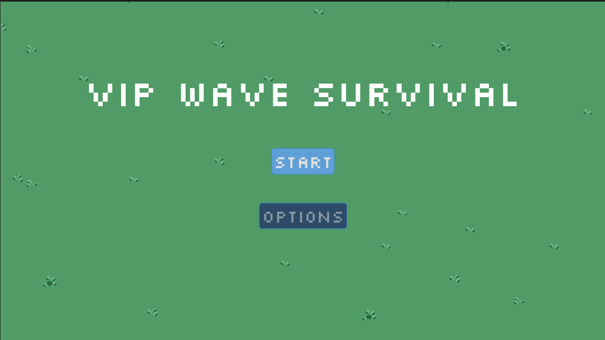

# Goals/Tasks

There were several priorities in my work for the week, since we needed to have a finalized Minimum Viable Product by the end of the week. I first prioritized slight refactoring of the wave system along with implementation of menus. Since one of our core design pillars for the game was that it would be a co-operative experience, I also had find a way to implement multiplayer. However, multiplayer was assigned a lower priority than the simpler tasks like refactoring and menu implementation because those simpler tasks were more pertinent to making sure the core mechanics and some polish were implemented to make it a minimally viable game. Multiplayer, despite being a core pillar, was slightly less important because the game was still playable without it.

## Wave System Refactoring

The refactoring needed for the wave system at this point wasn't too big, though still necessary. The first two changes I made were for [clarity and idiomaticism](https://github.com/KxtR-27/CS414_VipWaveSurvival/commit/19d1da49f418543881673340ade0105f71082cd2). This involved some name changes as well as a reset function for the enemy spawn timer that allowed the `"spawning speed multiplier"` to be set in a way that was more readable. I also added a `CanvasLayer` that [displays the wave number](https://github.com/KxtR-27/CS414_VipWaveSurvival/commit/a6df45d528be130111068961c1996506c5867e15) at the start of each wave, so that the timer indications are clearer to the players. The next step in refactoring this system will be to allow it to produce infinite waves using a somewhat predictable and controllable method of random number generation. However, I haven't looked into the possible options for that yet besides what I found when first mocking up the wave system.

## Menus

### Main Menu

Generally, menu creation is pretty easy, so I knew this task would not take me too long. However, I did end up fighting with `Control` nodes for a little while before I figured out how to get the desired effect from them. I kept trying to use the built-in Godot Container nodes to get the effect I wanted to no avail, so in the end I decided against using containers and just positioned the nodes individually. I might revisit the containers so that it's easier to add new elements if needed, but custom positioning works well enough for now so it's a low-priority fix.

This is what the main menu looks like at the moment (the option button is disabled because we haven't implemented any options yet):

### Character Selection Screen

Ironically enough, I ended up having a very similar struggle with Container nodes when creating the Character Selection screen. I figured out a solution to what I was trying to achieve in the end, but these containers stumped me for longer than I care to admit.

For the character selection screen, I first made some [assets](https://github.com/KxtR-27/CS414_VipWaveSurvival/commit/aa1eb5782361a3fa3c8a30667ec9b6f549f11df7#diff-6f7381ce71504a79be6b80c6175b4b7007ba1151d439a6bb6a4b00e1f4b861f6): a background box for the character selection and some arrow assets. Then, I used these assets in a [`CharacterSelectComponent`](https://github.com/KxtR-27/CS414_VipWaveSurvival/commit/aa1eb5782361a3fa3c8a30667ec9b6f549f11df7#diff-6db1c1d018e0902d8c475917b6376399be7400599dcba1f3238dc6885e440ec7). This component was as much for visuals as for functionality, as the component allows you to choose the character you spawn in as. Right now, all that means is that your player character spawns in with a different spritesheet, but eventually we should be able to replace this pretty easily with specialized characters (once we create new player character classes/types). 

*Note: Unfortunately, I don't have a separate commit for just the implementation of the component and screen itself because I was working on them in tandem with local multiplayer configuration so that the `CharacterSelectScreen` populated with a new player joining, and as a result, I struggled to find good stopping points at which to commit my changes. In hindsight, there was definitely a few places that I should have stopped to commit, but unfortunately I did not, so the commit history here just has one large commit.*

## Local Multiplayer Implementation

I knew going into the multiplayer implementation that it wouldn't be easy, but somehow I still underestimated how difficult it would be. The main issue I ended up running into was the sheer lack of resources on this topic. I'm not sure why, but the only resources I could find online were just a handful of old posts here and there asking the same question, most of which didn't offer a solution, or some videos which pointed you to a hard-coded input map that would require manually duplicating the input mappings for each supported player. Needless to say, a hard-coded input map would be difficult to maintain and lack scalability. Besides that, it would also require that the device that responds to each input mapping is set in advance, which locks players into the order their controllers connect and potentially removes the ability for both keyboard/mouse and joypads to be connected at the same time, depending on how the devices are set in the map.

In the end, I derived a solution from the small combination of resources I could find on the subject, drawing most from [this old answer](https://forum.godotengine.org/t/how-to-make-a-local-multiplayer-game/25010) from December 2020 posted on the Godot Forum in response to a similar question posted in April 2019. Despite being outdated and written using an old version of Godot, I found it the most useful out of the other resources I could find. Roughly using the framework proposed in that answer, I was able to create a [`PlayerTracker`](https://github.com/KxtR-27/CS414_VipWaveSurvival/commit/451dbc98cec8bdd9d0f038238fceb51db1919d20#diff-c2baa0fb6b603d70c5dd56f7f199d9c4da2f66469369747fff147faf80b06dcc) that kept the list of connected players in an array. The array held the integer assigned to the player's connected device, and when the `"join"` action was triggered (regardless of device), the `_input` function would check whether the device was already in the array. If it wasn't, a `player_joined` signal would emit containing the `device_id`, the `device_id` was added to `connected_player_array`, and the `add_player` method was called, which then called a mapping method that added actions that belonged exclusively to that device to the `InputMap`  (at this point the `add_player` method was written a little redundantly, this was addressed in a later commit). Then, I went to the `BasePlayer` class and changed the action names to `"'action'%d" % player_index`, so that the appropriate action listed in the `InputMap` was called based on `player_index` (which was set in the `CharacterSelectScreen` using the `player_joined` signal emitted by `PlayerTracker`).

That was enough to start dynamically adding the `CharacterSelectComponents` to the `CharacterSelectScreen`, which helped me test whether multiplayer was working.

After figuring that much out, I was close to but not quite finished with the multiplayer implementation. My next step was [applying the dynamically added inputs](https://github.com/KxtR-27/CS414_VipWaveSurvival/commit/035b6751d7284657cef5422ecef1b7ad24b0230d) to all necessary input actions (which was essentially every action except `"join"`) by using that `"'action'%d" % player_index` formula. Once I finished that, I [added more mappings](https://github.com/KxtR-27/CS414_VipWaveSurvival/commit/035b6751d7284657cef5422ecef1b7ad24b0230d#diff-c2baa0fb6b603d70c5dd56f7f199d9c4da2f66469369747fff147faf80b06dcc) to the `PlayerTracker` global script, specifically so that I could have the same actions with different mappings based on whether they were for keyboard or joypad. This led to some reduntancies that I intended to address later with a refactoring. Despite having the inputs separately mapped, I started to run into issues with the player inputs being read together, where one player device would end up controlling another while that other player device was unable to control either. It took me a little while, but I eventually realized I was accidentally overriding the `device_id` when instantiating a player, so depending on the order players joined and selected a character, the separate inputs weren't being read because the instantiated player's `device_id` was wrong. Once I realized my mistake, I was able to easily fix it by adjusting the parameters that my signals in [`PlayerTracker`](https://github.com/KxtR-27/CS414_VipWaveSurvival/commit/5b10179fea9dc651d2d85dd382f2de0dbf586134#diff-c2baa0fb6b603d70c5dd56f7f199d9c4da2f66469369747fff147faf80b06dcc) and [`CharacterSelectComponent`](https://github.com/KxtR-27/CS414_VipWaveSurvival/commit/5b10179fea9dc651d2d85dd382f2de0dbf586134#diff-804d7ced8f55d4c0e67639ac3878e21fb0ba702549932605062c4c41c60478c2) were being emitted with.

Finally, I took all the code related to input-mapping that was in the `PlayerTracker` and extracted it to separate [joypad](https://github.com/KxtR-27/CS414_VipWaveSurvival/commit/5b10179fea9dc651d2d85dd382f2de0dbf586134#diff-406747178d879fb991089d27ae380e4d47cb5ae18bd7dacbc52953e2e6b59424) and [keyboard](https://github.com/KxtR-27/CS414_VipWaveSurvival/commit/5b10179fea9dc651d2d85dd382f2de0dbf586134#diff-817251c13af45300d10774d1883b1ab34b11de167246cbcc94fdb2c93a687387) control mappers. This way, there was more separation of concerns, and `PlayerTracker` only kept track of the players that joined and sent them to their respective mapping scripts instead of doing all that computing itself.

# Estimated v.s. Actual Time

Most of my tasks for the week, with the exception of the slight refactoring of the wave system, ended up consuming much more time than expected. Like I mentioned, even the menus took longer than expected (although that might just be because I could stand to be more familiar with operating `Control` nodes). Local multiplayer implementation took the majority of about 3 days, but I'm proud of how it turned out despite how much time it consumed. The plan is to ultimately add peer-to-peer multiplayer as well, so now knowing how long local co-op took to implement, I'm going to assume peer-to-peer will take 1-2 weeks minimum to start getting into place.

# Communication and Asking for Help

I made sure to ask for help when I needed it this week, particularly when it came to the local multiplayer implementation. I try to communicate as often as needed and as often as I am available, plus we make sure to check in during class, so I generally feel good about our team's communication.