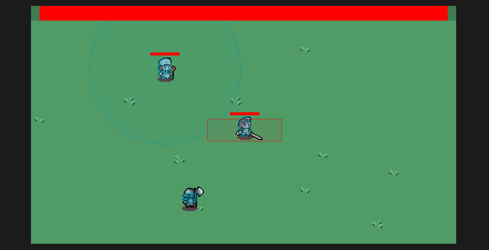
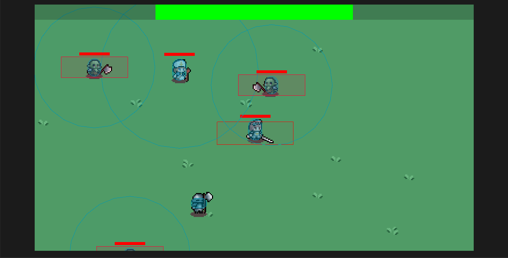

# Goals/Tasks

My main goal for the week was to create a wave system for spawning enemies. Since one of the core mechanics of our game is the waves of enemies, it was essential to implement this system for our Minimum Viable Product.

## Enemy Spawning (Wave System)

I started out by [implementing a skeleton for the wave system](https://github.com/KxtR-27/CS414_VipWaveSurvival/commit/2950fca7a5d17390d25f3d46d67c837268a8c126). Following part of the [Godot "First 2D Game" tutorial](https://docs.godotengine.org/en/stable/getting_started/first_2d_game/index.html) for spawning enemies, I implemented a enemy spawner that uses the Path2D and PathFollow2D nodes. Then, in the script, I could use randf() to randomly choose a point along the path for the enemy to spawn in at. The spawning mechanism is simply an instantiation of our enemy scene, which then has its speed and position set before being added to the scene tree.

Creating the initial wave system skeleton wasn't too difficult, but refining it proceeded to take several long hours. There are still improvements to be made, and it could certainly use labels or other indicators of what is occurring in each wave or at each stage in the wave system, but after a lot of trial and error I was able to [flesh out](https://github.com/KxtR-27/CS414_VipWaveSurvival/commit/43bba3a518c43a59ce149aa49c0d686b68545824) the wave mechanic. One of the main difficulties was making the waves repeatable, but also changing the effects and lengths of different waves. In hindsight, the solution to this shouldn't have been all that difficult to figure out, although in the moment it had me wracking my brain. In the end, one of the breakthroughs I had included figuring out that I could create a dictionary that held the stats for each wave, which allowed me to easily set and change parts of the wave system like the length of a particular wave or the speed of enemies during that wave.

### Progress Photos

Here are two photos that demonstrate how our waves currently look: 
 
The progress bar at the top of the screen counts down in a red color, which means that a wave is currently active and enemies are spawning into the scene. 
 
When the timer behind the red bar runs out, the bar switches to a green color and fills back up, indicating that there is a break before the next wave. While the progress bar is green, the enemy spawning mechanism is paused so that no new enemies spawn during the downtime between waves. 

# Estimarted v.s. Actual Time

As stated before, developing this wave system took much longer than I had planned for it to. If anything, the way this panned out was a good reminder to ask for help when needed, as I tried to power through it myself and probably could have been more productive and efficient if I had asked a teammate for help.

# Communication (is Key)

Our communication as a group is pretty thorough; we all send updates to each other as we make progress, and work to fix issues together if features break. Like I mentioned, I'll have to be better about asking for help if I'm running into a brick wall, so I will do my best to speak up in the future so that we don't end up falling behind.